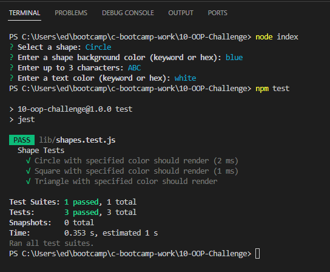
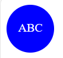

# 10-OOP-Challenge (SVG Generator)

## Description

This week's challenge was to build a Command Line Interface (CLI) based SVG generator using Node.js.

The following methods and concepts were used:
* Node.js
* Inquirer.js Node.js library
* Node.js File System (fs) module to create a file
* Jest js testing framework
* Classes

See the Usage section below for a description of the functionality.

## Installation

* Use npm i to install required modules - inquirer + jest
* Execute in CLI via 'node index.js'

## Usage

This application is a node.js aplication executed via the CLI.  It prompts the user for a shape (circle, triangle, square), background color, 3 initials and font color.
Based on the user's input, an SVG file is outputted to the examples folder.

A basic test suite was created to test the circle, triangle and square classes.

## Credits

No starter code was provided with this homework.  I used last week's challenge as well as sample code from this week's classes.  I also used Xpert Learning Assistant to help me with the SVG generation logic.

## License

MIT License